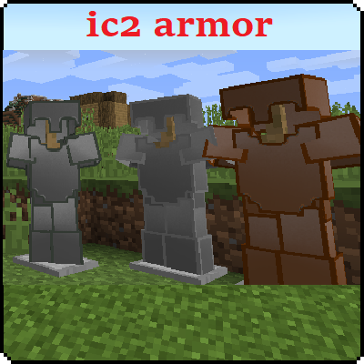

# Industrial craft 2 armor minecraft mod

This mod adds some armor that can be created from items in industrial craft 2.

## Installation

To successfully install this mod you need a industrial-craft-2 mod installed.

## Armor

Currently now the list of available armor is:

- Electrical Isolation armor that prevents you from getting electricity damage.
- Copper armor.
- Lead armor.
- Tin armor.

## GitHub Information

### Repo

### Issues

### Pull Requests

### Additional

## Special thanks

To user https://github.com/shadowfacts for sharing his creative tab.

Tu user https://www.youtube.com/@HarrysTechReviews for creating a video about modding recipes.

To user https://www.youtube.com/@TurtyWurty for his modding videos for 1.12.

And finally to user https://github.com/jexline for sharing his boneequipment mod source code.